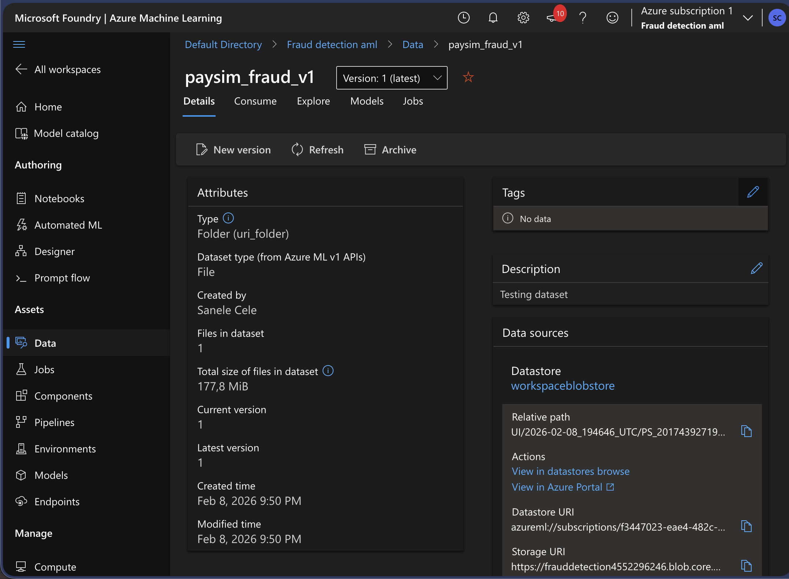
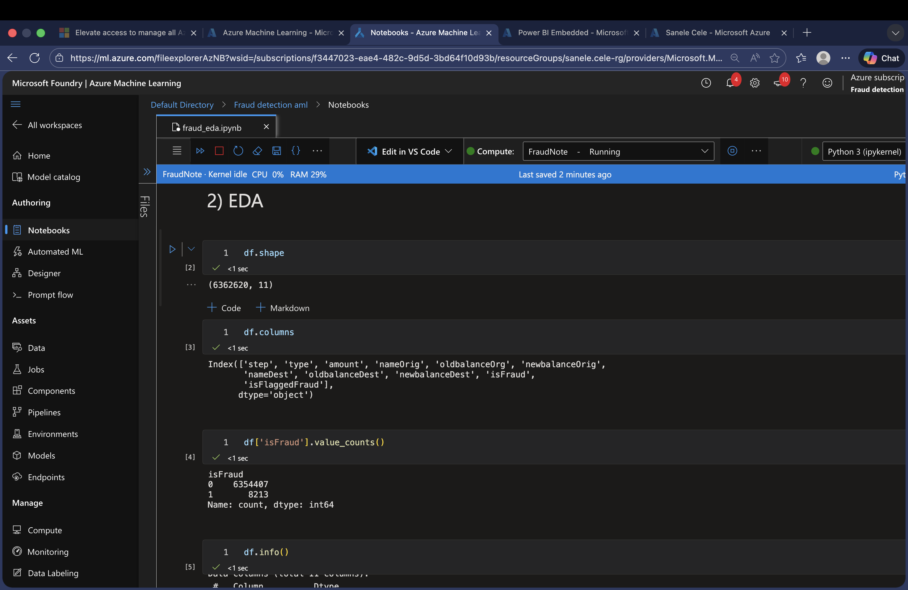
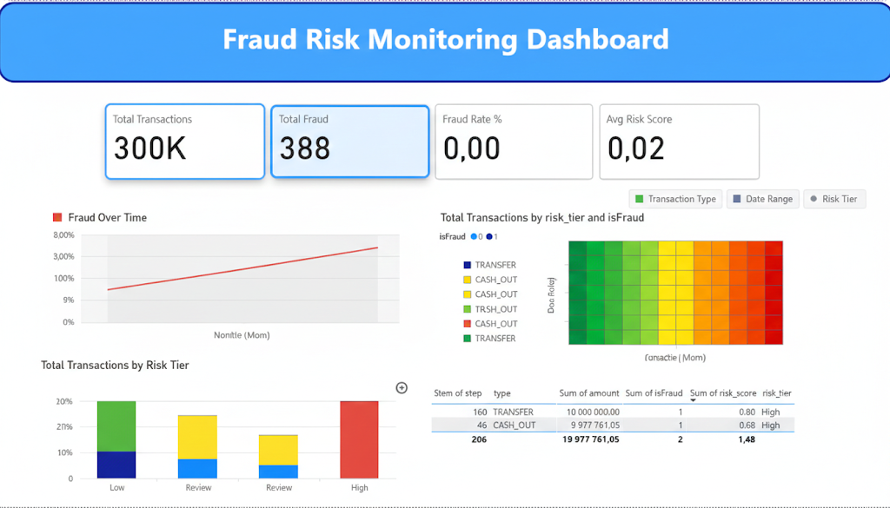

# PaySim Financial Fraud Detection Project Report

## 1. Motivation & Business Context

Fraud detection protects revenue, reduces customer harm, and prevents operational losses. Predicting suspicious transactions early allows fraud teams to review and intervene before losses occur. This project was motivated by the need to build a practical anomaly‑detection workflow that mirrors how fraud teams operate in real financial environments.

## 2. Project Overview

This project detects fraud using a multi‑model anomaly approach on the PaySim dataset. The workflow includes:
- **Isolation Forest** (statistical outliers)
- **Autoencoder** (neural reconstruction error)
- **DBSCAN** (cluster‑based anomalies)
- **Risk score engine + alert tiers** for business decisions

The output is a scored dataset (`fraud_scored.csv`) used in Power BI to create operational dashboards.

## 3. Data Source

The PaySim Financial Fraud Dataset is synthetic but realistic transaction data. Each row represents a transaction with timing, type, balances, and fraud labels. The dataset was registered as an Azure ML data asset and analyzed in Azure ML notebooks.

## 4. Procedures Performed

Environment Setup: Azure ML Workspace with compute instance and cluster. Libraries used: pandas, numpy, matplotlib, seaborn, scikit‑learn, tensorflow, joblib.

Data Exploration: Checked dataset shape, column types, and class imbalance.

Data Cleaning: Verified missing values and data types; no major missingness in core fields.

Feature Engineering: Created behavioral proxy features (e.g., amount‑to‑balance ratios, balance change signals, night‑time flag).

Model Building: Trained Isolation Forest, DBSCAN, and Autoencoder (sample‑based for scalability).

Risk Scoring: Combined anomaly signals into a unified risk score and assigned alert tiers (Low, Review, High, Block).

Cost Analysis: Simulated investigation cost trade‑offs using a simple cost model.

Explainability: Captured highest‑risk transactions to support investigation review.

Model Saving: Saved Isolation Forest model to `models/iso_fraud_model.pkl`.

Reporting: Exported scored dataset for Power BI and built a dashboard.

## 5. Technical Environment & Reproducibility

The project was executed in Azure ML Studio using a compute instance and cluster. Artifacts are stored locally in the repo, with scripts and notebooks under `src/`. The pipeline can be reproduced using the notebook and data assets captured in this repository.

## 6. Findings & Results

Class Distribution Fraud is highly imbalanced (rare compared to non‑fraud). This motivates anomaly‑detection rather than supervised classification.

Risk Tier Output The risk scoring engine produces clear tiers for operational action (Low → Review → High → Block).

Autoencoder/Isolation Forest Output Both models detect unusual transactions based on statistical and reconstruction error signals, providing complementary anomaly detection signals.

## 7. Limitations & Challenges

The dataset is synthetic and may not fully reflect real‑world fraud behaviors. Sampling was required for DBSCAN and Autoencoder due to dataset size. Thresholds and cost assumptions are illustrative and should be tuned with real business data. No time‑based validation was performed.

## 8. Business Implications

The model provides a realistic fraud‑monitoring framework that combines multiple anomaly signals. Risk tiers make fraud review actionable and reduce noise. Even with rare fraud, this approach can reduce losses by surfacing the most suspicious transactions early.

## 9. Rationale for Model Choice

Isolation Forest is widely used for anomaly detection in finance due to scalability and interpretability. DBSCAN captures cluster‑based anomalies that do not appear as simple outliers. Autoencoder adds deep‑learning capability and captures complex behavioral patterns. Together, they form a layered fraud detection system.

## 10. Conclusion

This project demonstrates a full end‑to‑end fraud detection pipeline in Azure ML: data registration, compute setup, EDA, feature engineering, anomaly modeling, risk scoring, cost analysis, and Power BI reporting. The solution is portfolio‑ready and mirrors real industry workflows.

## 11. Evidence & Artifacts

- EDA notebook (Azure ML export): `src/fraud_eda (2).ipynb`
- Model artifact: `models/iso_fraud_model.pkl`
- Data files: `data/PS_20174392719_1491204439457_log.csv` and `.zip`
- Scored export: `data/fraud_scored.csv`
- Azure ML evidence screenshots: `reports/figures/azureml/`
- Azure ML index: `reports/figures/azureml/index.md`
- Power BI visuals: `reports/figures/powerbi/`
- Power BI report: `reports/PaySim PowerBI Dashboard.pbix`
- Report: `reports/PaySim Dashboard.docx`

## Appendix: Evidence Snapshots

